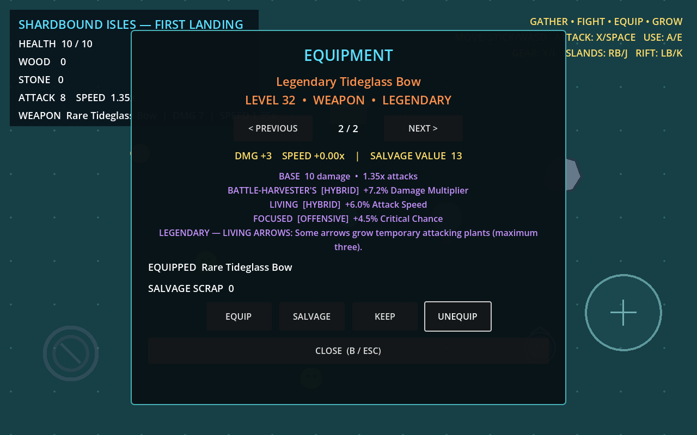

# M2 Diablo-like Loot — implementation evidence

Date: 2026-08-03  
Source criteria: `evidence/M2.txt`  
Result: complete

## Acceptance matrix

| Requirement | Result | Verifiable implementation/evidence |
| --- | --- | --- |
| WPN-001 | Pass | `ItemBaseRegistry` defines sword, bow, and wand in one data shape. `AttackProfileRules` and `FirstPlayableWorld` resolve a short slash, long narrow arrow, and multi-target wand splash through one attack path. Arena drops expose all three. Controller input is covered by integration tests. |
| ITEM-002 | Pass | `RarityRules` defines Common/Magic/Rare/Epic/Legendary weights and affix ranges. Fixed-seed distribution and cross-rarity value overlap are unit-tested; rarity changes rolls and salvage, not only color. |
| AFF-001 | Pass | `AffixRegistry` contains 16 stable definitions in all six requested categories with eligibility, ranges, weights, operations, and tags. Generator and UI consume registry data. |
| AFF-002 | Pass | Generator filters item restrictions, duplicate IDs, and conflict groups; bow-only and mutually exclusive elemental conversions are tested. Legendary effects use a separate field and slot budget. Static validation loads and validates all registries. |
| LOOT-002 | Pass | `LootGenerator` implements seeded base/level/rarity/count/pool/weighted/value/finalization stages. A 10,000-item validation checks eligibility, conflicts, duplicates, repeatability, and JSON round trips. |
| EQUIP-002 | Pass | `EquipmentInventory` owns typed weapon/helmet/body/boots/ring/amulet slots, recalculates effects from source items, removes them on unequip, and restores every slot through schema-4 saves. |
| STAT-001 | Pass | `StatBlock` supports base, additive, and multiplicative max health, damage multiplier, attack speed, crit chance/damage, movement speed, pickup radius, gathering power, and production speed. Formula and order are documented and no-stacking tests pass. |
| UI-002/UI-003 | Pass | Controller equipment modal shows level, slot, rarity name/color, base values, formatted affixes/categories, full legendary text, signed same-slot deltas, and no item score. Equip, Unequip, Keep, and Salvage stay visible at 1280x800. |
| SALV-001 | Pass | Successful salvage returns a rarity-and-level reward and only then removes the item. Equipped and favorited items are rejected in domain logic and UI. |
| LEG-001 | Pass | `LegendaryBehaviorRegistry`, `LegendaryEventBus`, and `LegendaryBehaviorManager` attach separate scripts for attack/kill/resource-hit/resource-use events and disconnect on equipment replacement. There is no item-ID behavior switch. |
| LEG-002 | Pass | Chain Mining uses deterministic sorted targets, a four-target cap, tick cooldown, depth guard, visual trigger, and 1,000-event stress coverage. |
| LEG-003 | Pass | Burning Smelter consumes a unique burning death, smelts nearest ore or grants one charge, and emits visible feedback without recursively creating a new death event. |
| LEG-004 | Pass | Living Arrows uses an explicit seeded stream, caps plants at three, attacks periodically, expires at six seconds, and excludes temporary plants from saves. |
| LOOT-003 | Pass | Materials merge, ground equipment caps at 40, low-rarity/old non-legendary drops are first cleanup candidates, Epic/Legendary drops get a visibility beam, and Legendary drops are protected. `LootFilter` includes disabled-by-default future auto-salvage policy. A 200-drop integration test stays bounded. |

## Automated validation

Final full command:

```text
powershell -NoProfile -ExecutionPolicy Bypass -File tools/dev.ps1 validate
```

Result: exit 0; Godot 4.7.1 import completed; `STATIC_RESULT checks=21 failures=0`; `TEST_RESULT suite=all assertions=465 failures=0`. JUnit: `build/test-results/all.xml`.

Layer contracts exercised during implementation:

- Unit: 239 assertions, 0 failures.
- Integration: 199 assertions, 0 failures.
- Simulation: 27 assertions, 0 failures.

Final deterministic metrics:

```json
M2_LOOT_METRICS {"elapsed_usec":1253781,"items":10000}
M2_CHAIN_METRICS {"effects":145,"elapsed_usec":11376,"events":1000}
M2_METRICS {"chain_targets":4,"derived_max_health":20.214,"derived_movement_speed":258.0,"equipped_slots":6,"generated_items":7,"items_valid":true,"living_plants":3,"remaining_items":6,"salvage_reward":3,"seed":100001,"smelting_charges":1,"triggered_effects":["chain_mining","burning_smelter","living_arrows"],"weapon_styles":3}
```

The final integration-only rerun also returned exit 0 with 199 assertions after switching arena sword/wand drops to `LootGenerator`.

## Gameplay and visual evidence

The fixed M2 simulation generates seven items, equips all six slots, derives equipment stats, salvages one eligible item, and triggers Chain Mining, Burning Smelter, and Living Arrows. The world integration contract additionally executes actual controller attack input, verifies the three target shapes, restores schema-4 equipment, keeps three temporary plants, and bounds a 200-equipment-drop scenario.



Manual artifact review: 1280x800 exactly; the item panel fits the viewport; base stats, three ordinary rolls, full Living Arrows text, signed comparison, salvage reward, and all actions are readable; long text wraps without clipping; controller focus is visible on Unequip; no missing assets or unwanted transparency were observed.

## Export evidence

Commands:

```text
powershell -NoProfile -ExecutionPolicy Bypass -File tools/dev.ps1 export-windows
powershell -NoProfile -ExecutionPolicy Bypass -File tools/dev.ps1 export-linux
```

Both returned exit 0 after the final gameplay integration. The exported Windows executable was launched with `--headless --quit-after 120` in isolated user directories and returned exit 0.

| Artifact | Bytes | SHA-256 |
| --- | ---: | --- |
| `build/windows/ShardboundIsles.exe` | 102,982,144 | `1CB23CEC5F4DE7FA6C884CD61AF3B5B3DF52B7D0F82638AA36B241A1CFDC3244` |
| `build/windows/ShardboundIsles.pck` | 321,764 | `FC8C3BB3BD08CF96970CFB27E97D3B497DF92D1722857AE9A3D45CD6A08036DD` |
| `build/linux/ShardboundIsles.x86_64` | 73,675,128 | `0B20D290D99AB6E73B1B5888BEA582859FDE5BE8116160F0EB192CC1B2611808` |
| `build/linux/ShardboundIsles.pck` | 321,764 | `FC8C3BB3BD08CF96970CFB27E97D3B497DF92D1722857AE9A3D45CD6A08036DD` |
| `build/linux/ShardboundIsles.sh` | 136 | `BBD8B44498B1133C3005C9E634D65B39D6A2805AFCE74183CCB1027F41EC74F3` |
| `evidence/m2-loot-tooltip-1280x800.png` | 124,745 | `2905E278C5EA82DD5059BD9793E377001C0566FFC47D89E263A0CB0BEBE96254` |

## Known limitations

- Automatic low-rarity salvage is intentionally disabled; M2 provides the policy boundary for a later opt-in feature.
- Performance guards run on the Windows development host, not Steam Deck hardware, so they do not certify device frame time.
- Godot prints a host root-certificate-store warning after successful headless commands; it does not affect import, tests, local offline play, or exports.
