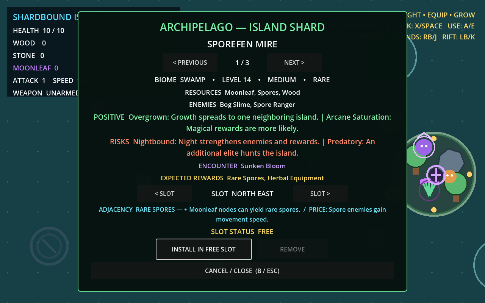
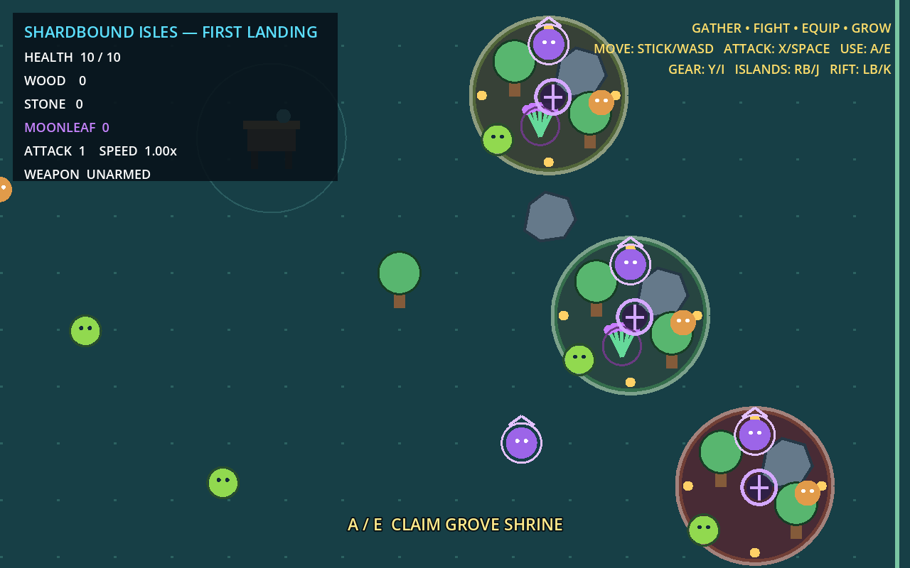

# M3 — The World Is Loot implementation evidence

Date: 2026-08-03  
Result: repository-side Gate M3 complete

## Acceptance matrix

| Requirement | Result | Verifiable evidence |
| --- | --- | --- |
| WORLD-001 | Pass | `ArchipelagoModel` owns world seed, three stable axial slots, installed definition/runtime pairs, deterministic sorted neighbors, revision, and serialization. Unit tests reject Node references and verify JSON restoration. |
| ISL-001 | Pass | `IslandShardDefinition` validates every required field. Definitions remain inventory/UI data; `IslandRuntimeState` separately owns mutable progress. Schema-5 inventory round trips uninstalled shards. |
| ISL-002 | Pass | Seed/level generation is repeatable, uses six biome pools and level-dependent modifier counts, pairs every reward modifier with risk, rejects duplicates/conflicts, and validates 10,000 generations. |
| ISL-003 | Pass | Controller modal shows biome, level, size, rarity, resources, enemies, positive modifiers, risks, encounter, expected rewards, selected slot, adjacency benefit/price, Install, Remove, and Cancel at 1280x800. |
| ISL-004 | Pass | Player chooses one of three slots. World validates and materializes before model/inventory mutation; invalid definitions and forced materialization failures preserve inventory. Successful installs consume one shard and save. |
| ISL-005 | Pass | UI requires a second Replace/Remove press after a consequence warning. Entire materialized subtrees are detached and freed; removed shards return to inventory; replacement refreshes adjacency; player occupancy blocks removal. |
| BIO-001 | Pass | Forest physically contains trees, stone, Moonleaf, Slime, Forest Ranger, Grove Shrine, plus Dense Growth resources and Predatory elite pressure. Three Moonleaf craft Herbal Compass for +40 pickup radius. |
| MOD-001 | Pass | Eight registry definitions cover enemy/resource/weather/reward/production/adjacency/encounter. `IslandModifierManager` loads independent script components, aggregates effects, and clears lifecycle without an ID switch. Definitions persist with the shard. |
| MOD-002 | Pass | Dense Growth adds nodes; Predatory adds an elite; Volatile Ore damages nearby enemies with visible feedback; Arcane Saturation adds magical event loot; Nightbound strengthens enemies/rewards; Overgrown adds a neighboring resource node. Preview names/describes each, and physical islands show modifier markers. |
| ADJ-001 | Pass | Hex neighbors are computed from coordinates. Install/remove/replace/load rebuild affected materialization and synergy state once per mutation; no per-frame graph calculation exists. Unit tests cover each mutation. |
| ADJ-002 | Pass | Forest+Swamp Rare Spores, Volcano+Frozen Obsidian Front, and Graveyard+Settlement Spirit Siege are registry tradeoffs. Generic preview exposes benefit and price before placement. Unordered pairs contribute once, preventing stacking. |
| ISL-006 | Pass | Schema 5 stores definition seed/level and runtime version, destroyed resource IDs, claimed reward IDs, and encounter completion. Load suppresses destroyed nodes and claimed Shrine rewards. Schema 4 migrates to East; unsupported versions fail safely. |

## Automated validation

Final command:

```text
powershell -NoProfile -ExecutionPolicy Bypass -File tools/dev.ps1 validate
```

Result: exit 0; Godot 4.7.1 import completed; `STATIC_RESULT checks=24 failures=0`; `TEST_RESULT suite=all assertions=597 failures=0`. JUnit: `build/test-results/all.xml`.

Layer results:

- Unit: 319 assertions, 0 failures.
- Integration: 239 assertions, 0 failures.
- Simulation: 39 assertions, 0 failures.

Final M3 metrics:

```json
M3_SHARD_METRICS {"biomes":6,"elapsed_usec":302394,"items":10000}
M3_METRICS {"destroyed_resources":1,"forest_unique_resource":"moonleaf","installed_slots":1,"inventory_shards":2,"synergies_created":1,"volatile_triggered":true,"world_seed":73000}
```

The deterministic simulation obtains and previews shards, places Forest and Swamp, activates Rare Spores, destroys a resource, saves/loads it absent, replaces Forest with an Overgrown-adjacent Volcano, visibly triggers Volatile Ore, then removes the neighbor and verifies adjacency cleanup.

## Gameplay and visual evidence



Manual review: the panel fits exactly within 1280x800; biome/level/size/rarity, resources, enemies, two positive modifiers, two risks, encounter, expected rewards, selected slot, Rare Spores benefit/price, Install, Remove, and Cancel are readable. Long modifier and synergy text wraps without clipping. Install has visible controller focus.



Manual review: all three islands are visible and spatially separate; each contains resource/enemy/event silhouettes and modifier markers; Forest/Swamp/Volcano presentation differs by island ground color; HUD remains readable; no missing assets, unintended clipping, or invalid layering were observed.

## Export evidence

Commands:

```text
powershell -NoProfile -ExecutionPolicy Bypass -File tools/dev.ps1 export-windows
powershell -NoProfile -ExecutionPolicy Bypass -File tools/dev.ps1 export-linux
```

Both returned exit 0. The final Windows artifact launched with `--headless --quit-after 120` in isolated user directories and returned exit 0.

| Artifact | Bytes | SHA-256 |
| --- | ---: | --- |
| `build/windows/ShardboundIsles.exe` | 102,982,144 | `1CB23CEC5F4DE7FA6C884CD61AF3B5B3DF52B7D0F82638AA36B241A1CFDC3244` |
| `build/windows/ShardboundIsles.pck` | 393,840 | `C2E8060CED88FAF0566B60AB58DD8D6883A91672334872DBE2C05E7F58D0EABB` |
| `build/linux/ShardboundIsles.x86_64` | 73,675,128 | `0B20D290D99AB6E73B1B5888BEA582859FDE5BE8116160F0EB192CC1B2611808` |
| `build/linux/ShardboundIsles.pck` | 393,840 | `C2E8060CED88FAF0566B60AB58DD8D6883A91672334872DBE2C05E7F58D0EABB` |
| `build/linux/ShardboundIsles.sh` | 136 | `BBD8B44498B1133C3005C9E634D65B39D6A2805AFCE74183CCB1027F41EC74F3` |
| `evidence/m3-shard-preview-1280x800.png` | 148,768 | `C2BE1859AC36BBCCCBAE9E4393185AF4ED80971CCF3B8859C755CA90C3548C42` |
| `evidence/m3-physical-archipelago-1280x800.png` | 73,655 | `385AF90C0BB5C6F21FA26DC292711469928DFD3989985D2F684306CC6DF1B9E6` |

## Known limitations

- Automated and visual evidence proves comprehension, placement, physical change, modifier behavior, and adjacency mechanics; whether the loop creates delight requires a human controller playtest before content expansion.
- M3 fully authors Forest gameplay. Other biomes use the same validated materialization contract and their modifiers/synergies, but biome-specific content breadth beyond the requested Forest island remains intentionally small.
- Performance metrics are from the Windows development host, not Steam Deck hardware.
- Godot emits a host root-certificate-store warning after successful offline headless commands; it does not affect import, tests, play, save/load, or exports.
